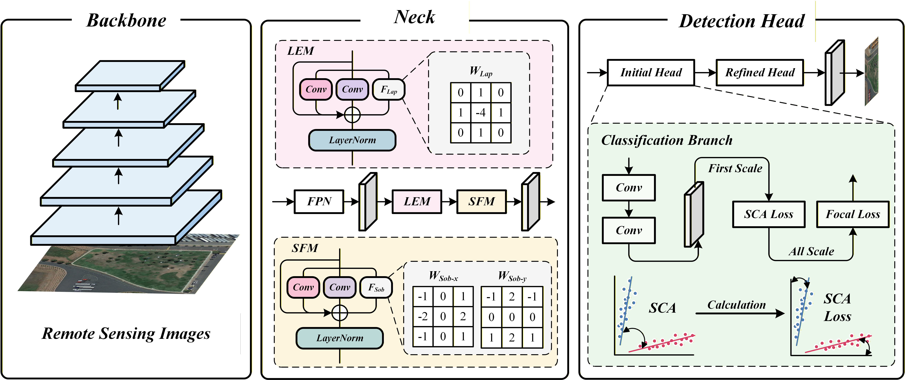
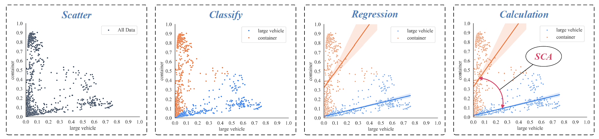
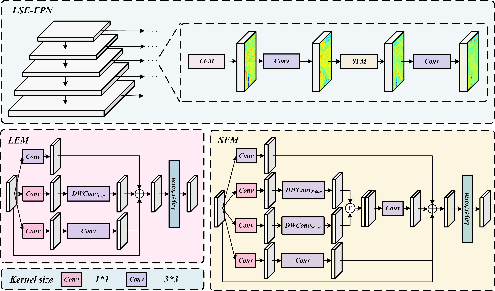

# SCENet
---
This is the official repository for ["Similar Category Enhancement Network for Discrimination on Small Object Detection"](https://ieeexplore.ieee.org/document/11223957) in IEEE Transactions on Geoscience and Remote Sensing (TGRS)



## Abstract
---
Object Detection is a fundamental procedure in the interpretation of remote sensing images. In large-scale remote sensing images, it is common to observe that the interesting objects only occupy a small area. Such objects provide limited information gain and exhibit unclear edges, often named as small objects. The inherent characteristics of small objects significantly hinder the precise localization and accurate classification of deep object detection networks. In this paper, we introduce a significant challenge: the presence of similar objects among these small objects, which leads to dramatic misclassification and overall accuracy decrease. To assess this phenomenon, we propose a novel metric, Similar Category Angle (SCA), for classification discrimination, which serves to intuitively describe the network’s effectiveness in discriminating similar category objects in its final predictions. We also propose a one-stage object detection network named Similar Category Enhancement Network (SCENet), designed to tackle the challenges associated with discriminating similar objects in small object detection tasks. Specifically, we design SCA Loss guided by the SCA metric, which integrates SCA into the network training process, thereby enhances the network’s capability to discriminate between similar category objects. Meanwhile, we propose Laplacian Sobel Enhancement FPN, LSE-FPN, a module that incorporates dynamic edge extraction operators into the FPN to enhance the network’s ability to detect small objects by sharpening the explicit edges of objects in the feature map. Extensive experiments conducted on SODA-A, VisDrone2019 and FAIR1M-AIR datasets demonstrate the superiority of SCENet in the small object detection task, with significant improvements in detection results for both the mAP50 and SCA metrics. The code is available at https://github.com/weiziji01/SCENet.

### SCA Calculation


### LSE-FPN


## Citation
---
If the work or the code is helpful, please cite the paper:
```
@ARTICLE{11223957,
  author={Wei, Ziji and Zhang, Tianwei and Sun, Xu and Zhuang, Lina and Wang, Degang and Marinoni, Andrea and Gao, Lianru},
  journal={IEEE Transactions on Geoscience and Remote Sensing}, 
  title={Similar Category Enhancement Network for Discrimination on Small Object Detection}, 
  year={2025},
  volume={63},
  number={},
  pages={1-18},
  keywords={Object detection;Detectors;Measurement;Image edge detection;Remote sensing;Feature extraction;Object recognition;Accuracy;Training;Location awareness;Deep learning;remote sensing images;similar object identification;small object detection (SOD)},
  doi={10.1109/TGRS.2025.3628045}}
```

And, If you want to conduct experiments on FAIR1M-AIR dataset, please cite the original dataset source: [FAIR1M](https://www.sciencedirect.com/science/article/pii/S0924271621003269)
```
@article{SUN2022116,
title = {FAIR1M: A benchmark dataset for fine-grained object recognition in high-resolution remote sensing imagery},
journal = {ISPRS Journal of Photogrammetry and Remote Sensing},
volume = {184},
pages = {116-130},
year = {2022},
issn = {0924-2716},
doi = {https://doi.org/10.1016/j.isprsjprs.2021.12.004}}
```

## Ackonwledgement
---
The codes are based on [mmrotate1x](https://github.com/open-mmlab/mmrotate/tree/1.x). Thanks for their awesome work.

## Contact
---
For futher questions or details, please directly reach out to weiziji23@mails.ucas.ac.cn

